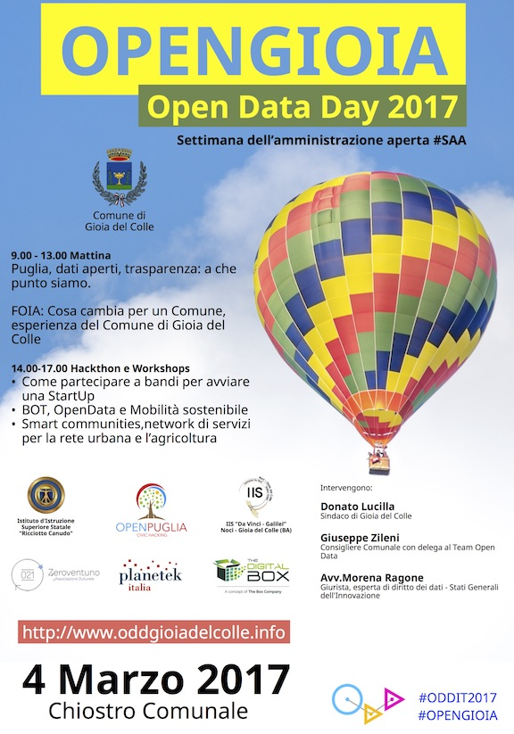

<section id="banner" class="style2">
  
  

    
    
      
    

    <header class="major">

    <h2>#OPENGIOIA</h2>

    </header>

    

    {{ page.description }}

    

  

</section>

  <section id="one">

    

      
      <header class="major">
        <h3>Registrati</h3>
      </header>

      
<iframe src="//eventbrite.com/tickets-external?eid=32081347173&ref=etckt" frameborder="0" height="275" width="100%" vspace="0" hspace="0" marginheight="5" marginwidth="5" scrolling="auto" allowtransparency="true"></iframe>
<a class="powered-by-eb" style="color: #ADB0B6; text-decoration: none;" target="_blank" href="http://www.eventbrite.com/">Powered by Eventbrite</a>

    

  </section>

  <section id="two" class="spotlights">

    <section>

      

      

        

          <header class="major">

          <h3>Programma</h3>

          

          </header>

          <h4>Ore 9.30/11..00 - Tavola Rotonda</h4>

          <strong>
          Puglia, dati aperti, trasparenza: a che punto siamo.  
          FOIA: Cosa cambia per un Comune, esperienza del Comune di Gioia del Colle.  
          Cosa abbiamo fatto finora, lo stato dell’arte: Intervengono Imprese, rappresentanti del terzo settore e della cittadinanza attiva. 
          </strong>

          
          <ul>
              <li>
                <a href="http://www.oddgioiadelcolle.info/2017/02/21/depurazioniamoci.html">
                ASOC - A Scuola di OpenCoesione con IISS Liceo Scientifico Ricciotto Canudo DepurAzioniamoci</a>
              </li>
              <li>
                <a href="http://www.oddgioiadelcolle.info/2017/02/21/isola.html">
                ASOC - A Scuola di OpenCoesione con IIS Da Vinci-Galileo con L’ISOLA CHE….SARA</a>
              </li>
              <li>
                  <a href="http://www.oddgioiadelcolle.info/2017/02/02/eugenius.html">Progetto EUGENIUS</a>
              </li>
              <li><a href="http://www.oddgioiadelcolle.info/2017/02/21/friends.html">Trip Friends</a></li>
              <li><a href="http://www.oddgioiadelcolle.info/2017/02/21/wikigioiadelcolle.html">WikiGioiadelColle</a></li>
          </ul>

          

            <h4>Ore 14.30/11..00 - Workshops e Hackthon</h4>

            <em>
            Ciascun partecipante dovrà portare con sè il proprio portatile.
            </em>

          <ul>

            <li>
              <a href="http://www.oddgioiadelcolle.info/2017/02/02/startup.html">
              Come partecipare ad un bando/call sull’opendata e costituire una StartUP</a>
            </li>

            <li>
              <a href="http://www.oddgioiadelcolle.info/2017/02/02/mobility.html">
              BOT, OpenData e Mobilità sostenibile</a>
            </li>

            <li>
              <a href="http://www.oddgioiadelcolle.info/2017/02/02/eugenius.html">
              Smart communities,network di servizi per la rete urbana e l’agricoltura.
              </a>
            </li>

          </ul>

          

        

      

    </section>
  </section>

